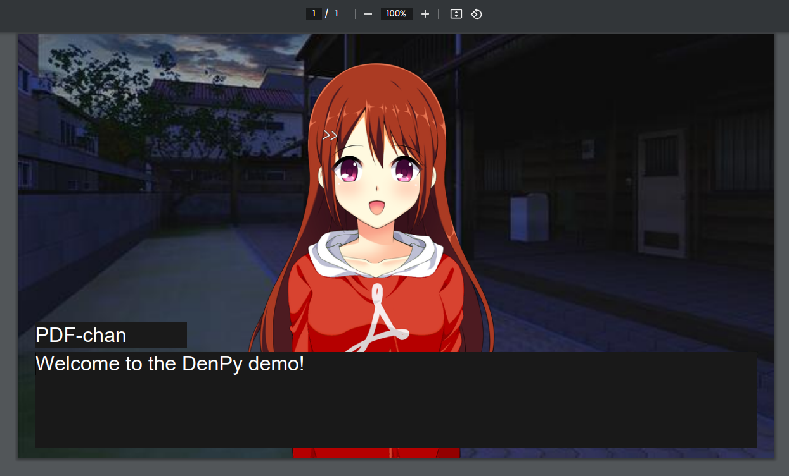

	

Python library that generates visual novels in PDF format.

## Why
1) "Read the PDF spec" has been in my TODO-list for years now.
2) I found [this talk](https://youtu.be/6rbJu10Telc) by Omar Rizwan, where he recreated the Breakout game in PDF.
3) As Ren'Py references Ren'Ai (romantic-love genre), DenPy references Denpa (a mix between technology and psychological horror genres). \
    You must be losing your mind if a PDF is talking to you.

## Play the Demo!
Download the demo for the language you want and click on the textbox to progress in the story.

Note: **Use a chromium-based browser**, as it doesn't seem to work with Firefox's PDF renderer.

- [English](https://raw.githubusercontent.com/EDDxample/denpy/main/out/demo_en.pdf)
- [Spanish](https://raw.githubusercontent.com/EDDxample/denpy/main/out/demo_es.pdf)

Check `demo.py` for more information.

### Credits
- Backgrounds by mugenjohncel: https://lemmasoft.renai.us/forums/viewtopic.php?t=17302
- PDF-chan:
    - Character base by sutemo: https://sutemo.itch.io/female-character
    - Modifications by EDDxample and Kerbam.

## Resources
- PDF Spec: https://opensource.adobe.com/dc-acrobat-sdk-docs/pdfstandards/PDF32000_2008.pdf
- PDF JS API: https://opensource.adobe.com/dc-acrobat-sdk-docs/library/jsapiref/JS_API_AcroJS.html
- FPDF library: https://github.com/reingart/pyfpdf
- Horrifying PDF experiments: https://github.com/osnr/horrifying-pdf-experiments/tree/master
- Ren'Py: https://www.renpy.org
- Denpa: https://aesthetics.fandom.com/wiki/Denpa

## Missing features
All of these *seem* possible to implement, but require further reading for confirmation.
- Reshape the speaker box as needed.
- Text fade-in support.
- Smooth transition support.
- Music / sound support.
- Control flow (branches, multiple choices, etc).